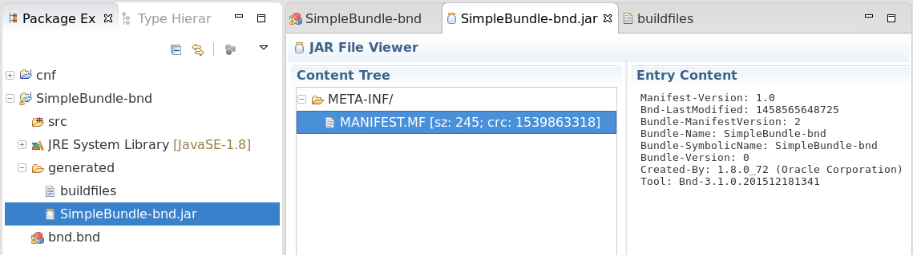

# Bndtools

[Bndtools](http://bndtools.org/) is an Eclipse plugin that integrates the (command line) tool bnd in Eclipse and provides "continuous build" for bundles. [Install](http://bndtools.org/installation.html) it now.

The tool [bnd](http://bnd.bndtools.org/) takes a different perspective on defining bundles. From bnd's point of view, `MANIFEST.MF` is the source of information about the bundle at runtime only. While developing the bundle, you need closely related, but sometimes slightly different information and  *additional* information. So, to bnd, `MANIFEST.MF` is an artifact that is generated during build time from information contained in a file called `bnd.bnd`. The eclipse plugin bndtools provides a GUI for editing `bnd.bnd` (again with the possibility to edit the source directly). 

There is a [tutorial](http://bndtools.org/tutorial.html) for Bndtools, which I found to be rather confusing. It addresses developers with some OSGi experience rather than users who want to get an (Eclipse based) environment for writing their first bundle. So let's simply once more focus on our Simple Bundle and port it to a Bndtools project.

Create a new Bndtools project in Eclipse using the wizard. Choose the Bndtools/Empty template, use `SimpleBundle-bnd` as project name. When asked for a "bnd configuration project" create one. You'll see two new projects in Eclipse. The `SimpleBundle-bnd`, which was to be expected, and a project `cnf`. Ignore the latter for the time being.

Have a look at the `generated` folder in `SimpleBundle-bnd`. Double-click on `SimpleBundle-bnd.jar` and then -- in the "Jar File Viewer" that appears -- double-click on `MANIFEST.MF`. Looks a bit familiar but much more verbose than what we have written so far. 

{: width="700px" }

Copy our source package into the `src` folder of the new project. Open `Activator.java` and have a look at the error. Looks familiar. Regrettably, there's no quick fix this time. Open `bnd.bnd` and select the "Build" tab. In the "Build Path sub-window use "+" to add `osgi.core`. Save the file and see the error disappear. If you switch to the "JAR File Viewer" again, you can see that the jar is still empty (apart from the `MANIFEST.MF`, of course). Bndtools doesn't include Java sources just because they are there. Rather, you have to add them to the "Private Packages" in `bnd.bnd`, tab "Content". Do this, save, and you can see your classes in the jar file now.

On tab "Content", you can also add the bundle's activator. At the time of this writing, using Bndtools 3.1.1, content assist didn't work. So you have to type (or copy paste) the class name into the field. Save again, and you can see the `Bundle-Activator` entry having been added to the generated `MANIFEST.MF`. You can also see it on the "Source" tab of `bnd.bnd`. The basic idea about the format of `bnd.bnd` is that entries that are to be copied to `MANIFEST.MF` look just like the entry in `MANIFEST.MF` (well, sometimes they are processed a bit). Entries that control the behavior of the bnd tool start with a dash.

Add version "1.0.3" in the "Content" tab of `bnd.bnd`. Save, and you can immediately install and start the bundle (the jar) in felix as with our previous projects.

If you want to continue using Bndtools, you should now start reading the [bnd documentation](http://bnd.bndtools.org/). I recommend to start with "[Introduction](http://bnd.bndtools.org/chapters/110-introduction.html)", proceed with "[Concepts](http://bnd.bndtools.org/chapters/130-concepts.html)" and read the rest as required when encountering problems with your projects.