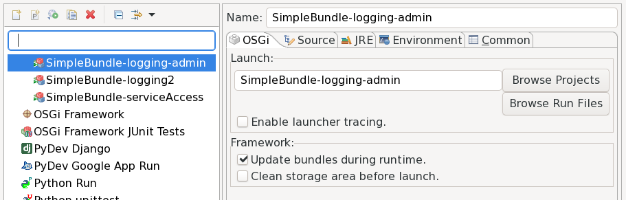

# The Configuration Admin Service

*Work in progress*

An important issue in a component framework is the configuration of the components.
Components might be usable out-of-the-box, but usually they must be adapted to the context. A common simple example is some component that listens on a network port which must, of course, be configurable.

The configuration information should be persistent, i.&nbsp;e. it must be preserved 
across restarts. It should also be modifiable during runtime and modifications should
be effective without restart. OSGi defines such a
service for maintaining and distributing configuration information as the 
"[Configuration Admin](https://osgi.org/specification/osgi.cmpn/7.0.0/service.cm.html)" service[^name].

[^name]: The name has always seemed a bit strange to me. The major task of this
	service is to maintain and spread configuration information. Of course,
	the service also provides an API for administering the information, but I'd
	never have focused on that aspect in its name.

## Configuration Admin in Action

Let's have a look at this service in action. Go back to the project from the part "[Using a Service](../UsingAService.html)" and remove the run property `org.osgi.service.log.admin.loglevel`, added as last step in order to actually get logging output. Then add `org.apache.felix.configadmin` and `de.dentrassi.osgi.net.luminis.cmc` to the run bundles (or checkout and import the [prepared project](https://github.com/mnlipp/osgi-getting-started/tree/master/SimpleBundle-logging-admin)). The former bundle adds an implementation of the Configuration Admin service to our run environment, the latter adds some commands to the Felix gogo shell. Unfortunately, the bundle with the gogo shell extensions is implemented using Declarative Services (as presented in the previous part), so we have to also add
`org.apache.felix.scr`. And because the current implementation (2.1.16 as of this writing)
uses OSGi promises and functions, we additionally have to add bundles `org.osgi.util.promise` 
and `org.osgi.util.function`[^listOfBundles]. Now we can start the framework with our "Hello World" application.

[^listOfBundles]: The complete list of bundles in the "Source" tab of `bnd.bnd` looks like this:
	```properties
	-runbundles: \
		org.apache.felix.log,\
		org.apache.felix.gogo.command,\
		org.apache.felix.gogo.runtime,\
		org.apache.felix.gogo.shell,\
		de.mnl.osgi.osgi2jul;version=1.1.3,\
		de.mnl.osgi.coreutils;version=1.0.3,\
		de.dentrassi.osgi.net.luminis.cmc;version=0.6.0,\
		org.apache.felix.configadmin,\
		org.apache.felix.scr,\
		org.osgi.util.promise,\
		org.osgi.util.function
	```

As you know from "Using a Service" we do not see any log messages from our bundle's classes
because they are logged with level `INFO` and the default threshold of OSGi loggers is `WARNING`. In "Using a Service" we fixed this with a bundle property that configured the OSGI log service. However, if a Configuration Admin service is available, OSGi loggers can also be configured using this service. Enter the following commands in the Felix console:

```
g! cm:create org.osgi.service.log.admin
g! cm:put org.osgi.service.log.admin ROOT INFO
Aug 13, 2019 6:39:10 PM LogService
INFORMATION: Hello Word sleeping
Aug 13, 2019 6:39:15 PM LogService
INFORMATION: Hello Word sleeping
```

And the log messages are back again. Before you restart the framework in order to check the persistence of the configuration, make sure to un-check the "Clean storage area" flag in the Eclipse run configuration generated by Bndtools:

{: width="600px" }

## Concepts

The Configuration Admin service maintains a database of Configuration Objects. 
The main purpose of configuration objects is to store key/value pairs[^ConfObjAPI].
Each configuration object has a unique PID (Persistent IDentity). The first command 
(`cm:create org.osgi.service.log.admin`) creates a configuration object with PID
`org.osgi.service.log.admin`. The command `cm:put org.osgi.service.log.admin ROOT INFO`
adds (to the just created configuration object with PID `org.osgi.service.log.admin`) the 
key `ROOT` with value `INFO`.

[^ConfObjAPI]: There's a bit more, configuration objects implement [this interface](https://osgi.org/javadoc/osgi.cmpn/7.0.0/index.html?org/osgi/service/cm/ManagedService.html).

Parties interested in configuration changes of a specific configuration object
register services of type `ManagedService`. [The Javadoc](https://osgi.org/javadoc/osgi.cmpn/7.0.0/index.html?org/osgi/service/cm/ManagedService.html) describes the basic usage pattern. If a party is interested in changes of lots of configuration
objects (e.&nbsp;g. objects with PIDs staring with a given prefix) is should register
a service of type [`ConfigurationListener`](https://osgi.org/javadoc/osgi.cmpn/7.0.0/index.html?org/osgi/service/cm/ManagedService.html) instead.


*To be continued*


---
