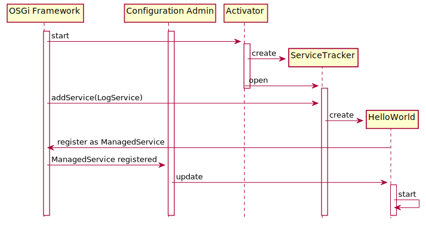
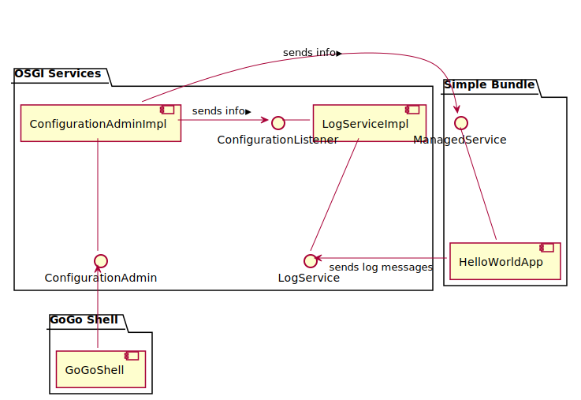

# The Configuration Admin Service

An important issue in a component framework is the configuration of the 
components. Components might be usable out-of-the-box, but usually they 
must be adapted to the context. A common simple example is some component 
that listens on a network port that must, of course, be configurable.

The configuration information should be persistent, i.&nbsp;e. it must 
be preserved across restarts. It should also be modifiable during runtime 
and modifications should be effective without restart. OSGi defines a
service for maintaining and applying configuration information as the 
"[Configuration Admin](https://osgi.org/specification/osgi.cmpn/7.0.0/service.cm.html)" service[^name].

[^name]: The name has always seemed a bit strange to me. The major task of this
	service is to maintain and spread configuration information. Of course,
	the service also provides an API for administering the information, but I'd
	never have focused on that aspect in its name.

## Configuration Admin in Action

Let's have a look at this service in action. Go back to the project from 
the part "[Using a Service](./UsingAService.html)" and remove the run 
property `org.osgi.service.log.admin.loglevel`, added as last step in order to 
actually get logging output. Then add `org.apache.felix.configadmin` and 
`de.dentrassi.osgi.net.luminis.cmc` to the run bundles (or checkout and import 
the [prepared project](https://github.com/mnlipp/osgi-getting-started/tree/master/SimpleBundle-logging-admin)). 
The former bundle adds an implementation of the Configuration Admin service 
to our run environment, the latter adds some commands to the Felix 
GoGo shell[^cmAddOn]. Unfortunately, the bundle with the GoGo shell 
extensions is implemented using Declarative Services (as presented 
in the next part), so we have to also add `org.apache.felix.scr`. And because 
the current implementation (2.2.0 as of this writing)
uses OSGi promises and functions, we additionally have to add 
bundles `org.osgi.util.promise` and `org.osgi.util.function`[^listOfBundles]. 
Now we can start the framework with our "Hello World" application.

[^cmAddOn]: The commands that this GoGo extension provides aren't 
	strictly necessary. The Configuration Admin implementation 
	adds the [`ConfigurationAdmin`](https://osgi.org/javadoc/osgi.cmpn/7.0.0/index.html?org/osgi/service/cm/ConfigurationAdmin.html)
	service to the GoGo shell (with scope "cm", just like the extension). 
	We could therefore execute all actions using the commands provided
	by the service as a starting point[^cmAlt]. However,
	the additional extension simplifies things.

[^cmAlt]: [Here](https://web.archive.org/web/20220113102917/https://rotty3000.doublebite.com/Introspect-Configuration-Admin-from-Gogo-Shell/)
    is an alternative approach.

[^listOfBundles]: The complete list of bundles in the "Source" tab of `bnd.bnd` looks like this:
	```properties
	-runbundles: \
		org.apache.felix.log,\
		org.apache.felix.gogo.command,\
		org.apache.felix.gogo.runtime,\
		org.apache.felix.gogo.shell,\
		de.mnl.osgi.osgi2jul;version=1.1.6,\
		de.mnl.osgi.coreutils;version=2.0.0,\
		de.dentrassi.osgi.net.luminis.cmc;version=0.6.0,\
		org.apache.felix.configadmin,\
		org.apache.felix.scr,\
		org.osgi.util.promise,\
		org.osgi.util.function
	```

As you know from "Using a Service" we do not see any log messages from 
our bundle's classes because they are logged with level `INFO` and the 
default threshold of OSGi loggers is `WARNING`. In "Using a Service" we 
fixed this with a bundle property that configured the OSGI log service. 
However, if a Configuration Admin service is available, OSGi loggers 
can also be configured using this service. Enter the following commands 
in the Felix console:

```
g! cm:create org.osgi.service.log.admin
g! cm:put org.osgi.service.log.admin ROOT INFO
Aug 13, 2019 6:39:10 PM LogService
INFORMATION: Hello Word sleeping
Aug 13, 2019 6:39:15 PM LogService
INFORMATION: Hello Word sleeping
```

And the log messages are back again. Before you restart the framework in 
order to check the persistence of the configuration, make sure to 
un-check the "Clean storage area before launch" flag in the Eclipse 
run configuration generated by Bndtools[^uncheckTooLate]:

{: width="600px" }

[^uncheckTooLate]: Using bndtools 6.1.0, this 
    [doesn't work](https://github.com/bndtools/bnd/issues/5061) any more.
    Instead, you have to add a line with `-runkeep: true` to the project's
    `bnd.bnd`.

Of course you can also query the information just entered:

```
g! cm:list
Configuration list:
----------------------------
org.osgi.service.log.admin                                    ?

g! cm:get org.osgi.service.log.admin
Configuration for service (pid) "org.osgi.service.log.admin" (bundle location = ?)
key           type               value
------        ------             ------
ROOT          java.lang.String   INFO
service.pid   java.lang.String   org.osgi.service.log.admin
```

The question mark that you see in the outputs is the value of the 
"bundle location" associated with a configuration object. A large part
of the Configuration Admin specification is 
about this bundle location and its handling. Dont't read it. More or less
by chance I found this[^strangeMissing]:

> Locations were a mistake in the Configuration Admin API. Ok, I’ve said it. 
> They were a failed attempt to provide security at an unsuitable place. 
> Mea culpa … The intention was that we could restrict configurations to 
> specific bundles, this restriction was actually automatic when the location 
> was set to null and a bundle used it. Countless hours have been lost figuring 
> out why Configuration Admin did not call update only to discover that the 
> location was wrong. Alas, the sins we commit when we try to specify.
> 
> So what should you do with the location? Well, just set it always to “?”. 
> This is a recent addition to the specification that basically removes the 
> awkward location check.[^citationUrl]

[^citationUrl]:  See [https://web.archive.org/web/20151103190624/http://enroute.osgi.org:80/services/org.osgi.service.cm.html](https://web.archive.org/web/20151103190624/http://enroute.osgi.org:80/services/org.osgi.service.cm.html)

[^strangeMissing]: It's one of those strange things in the OSGi context that they 
	didn't bother to put this information in the latest version of the 
	specification&mdash;at least not at a prominent enough place for me 
	to find it. 

## Concepts

The Configuration Admin service maintains a database of Configuration Objects. 
The main purpose of configuration objects is to store key/value pairs[^ConfObjAPI].
Each configuration object has a unique PID (Persistent IDentity). The first command 
(`cm:create org.osgi.service.log.admin`) creates a configuration object with PID
`org.osgi.service.log.admin`. The command `cm:put org.osgi.service.log.admin ROOT INFO`
adds (to the just created configuration object with PID `org.osgi.service.log.admin`) the 
key `ROOT` with value `INFO`.

[^ConfObjAPI]: There's a bit more to it, configuration objects implement 
    [this interface](https://osgi.org/javadoc/osgi.cmpn/7.0.0/index.html?org/osgi/service/cm/ManagedService.html).

Parties interested in configuration changes of a specific configuration object
register services of type `ManagedService`. If a party is interested in changes 
of lots of configuration 
objects (e.&nbsp;g. objects with PIDs starting with a given prefix) is should register
a service of type [`ConfigurationListener`](https://osgi.org/javadoc/osgi.cmpn/7.0.0/index.html?org/osgi/service/cm/ConfigurationListener.html) instead.

The log service registers a `ConfigurationListener` because you cannot only configure
the default log level as shown. There is a PID for each `LoggerContext` and the key/value
pairs in each configuration object correspond to logger names and log levels. The details
can be found in the [log specification](https://osgi.org/specification/osgi.cmpn/7.0.0/service.log.html#d0e2548).

You can check the registration of a `ConfigurationListener` by the log service in the GoGo shell:

```
g! each (allServiceReferences org.osgi.service.cm.ConfigurationListener null) { $it bundle }
    1|Active     |    1|org.apache.felix.log (1.2.0)
    8|Active     |    1|org.apache.felix.configadmin (1.9.16)
```

The system that we have configured looks like this:  

{: width="450px" }

As you may have guessed, the GoGo shell commands make use of the
[ConfigurationAdmin](https://osgi.org/javadoc/osgi.cmpn/7.0.0/index.html?org/osgi/service/cm/ConfigurationAdmin.html) 
service provided by the Config Admin implementation. This
is the interface that you'd also use to manipulate configurations 
from within your program.


## A Configurable Component

The obvious next step is to make our own component configurable in 
some way, which means that it has to register an implementation of
`ManagedService`. 
[The Javadoc](https://osgi.org/javadoc/osgi.cmpn/7.0.0/index.html?org/osgi/service/cm/ManagedService.html) 
describes the basic usage pattern pretty well. I've applied it 
to the "Hello World" sample application and made the message frequency 
configurable. You can find the resulting code in the 
[companion project](https://github.com/mnlipp/osgi-getting-started/tree/master/SimpleBundle-logging-admin2).

Note that the `update` method is always called at least once after registering a managed service. We can make use of this by moving the actual start of our application
to the `update` method. This results in the following startup sequence: 

{: width="550px" }

The application structure now includes an additional
relationship between the `ManagedService` exposed by the
"Hello World" application and the Configuration Admin service.

{: width="550px" }

You have probably already figured it out, try:

```
g! cm:create io.github.mnl.osgiGettingStarted.loggingBundle.HelloWorld
g! cm:put -t l io.github.mnl.osgiGettingStarted.loggingBundle.HelloWorld waitTime 10000
```

## Manufactured with Configuration Admin

In addition to configuring existing components, Configuration Admin
can be used to manage the creation and destruction of (service) 
components. This is achieved by registering a 
[`ManagedServiceFactory`](https://docs.osgi.org/javadoc/osgi.cmpn/7.0.0/index.html?org/osgi/service/cm/ManagedServiceFactory.html)
with a factory PID.

You create a new component configuration simply by
[getting](https://docs.osgi.org/javadoc/osgi.cmpn/7.0.0/org/osgi/service/cm/ConfigurationAdmin.html#getFactoryConfiguration-java.lang.String-java.lang.String-java.lang.String-)
it[^misnomer]. Whenever you subsequently
[update](https://docs.osgi.org/javadoc/osgi.cmpn/7.0.0/org/osgi/service/cm/Configuration.html#update--)
the configuration, the service factory's method 
[`updated`](https://docs.osgi.org/javadoc/osgi.cmpn/7.0.0/org/osgi/service/cm/ManagedServiceFactory.html#updated-java.lang.String-java.util.Dictionary-)
called. This method must then create an instance if a component with the
(instance) PID passed to this method does not exist yet, or update an
existing component -- whatever the meaning of an "update" means with respect
to the components managed[^usuallyForward].

[^misnomer]: To me, this sounds like a misnomer. What you get here is
    not a factory configuration, it's a configuration for something
    created or to be created by a factory. IMHO something like
    `getInstanceConfiguration` would have been more appropriate.

[^usuallyForward]: Usually you'll forward the properties to the existing
	component, but this isn't specified and thus completely up to the
	factory.

I've prepared a simple 
[sample project](https://github.com/mnlipp/osgi-getting-started/tree/master/Greeter) 
that you can use for some experimentation.

```
g! config = cm:getFactoryConfiguration GreeterFactory Test "?"
g! $config update (new java.util.Hashtable [text="Hello"])
New Greeter "GreeterFactory~Test" says: Hello
```


---
