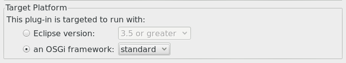
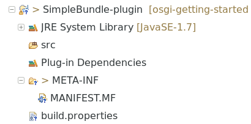
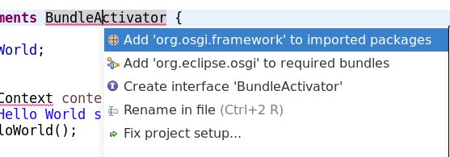

# Eclipse (OSGi) Plugin

While the basic mechanisms of OSGi are quite simple, managing an OSGi project can easily get complicated. The dependency on the `BundleActivator` in our Simple Bundle provided a first taste: because of using that OSGi interface, we had to add a jar to our project and an import statement to the project's manifest. Surely, an IDE should provide some support for this.

You may have heard -- Just like I did -- about OSGi for the first time when the Eclipse developers announced in 2003 that they'd use OSGi as foundation for the next Eclipse version. Since then, Eclipse has provided the Plugin Development Environment (PDE) which is essentially a development environment for OSGi plugins. If it is not already part of your Eclipse installation, get it now[^ESWI].

Create a new plugin project using the wizard. I used `SimpleBundle-plugin` as project name, because this is just a different way to build our Simple Bundle. You have to change two options while going through the dialogue. On the first page, make sure to choose a standard OSGi framework as target: 

{: width="500px" }

And on the last page uncheck the template option -- we want an empty project.

Looking at the resulting project, we find that it isn't completely empty after all. The wizard has created a `MANIFEST.MF` and a file `build.properties`.

{: width="300px" }

The `MANIFEST.MF` is here because -- remember -- it's the special entries in that file what makes a jar a bundle. PDE maintains almost the complete data required to build the bundle in `MANIFEST.MF`. This sounds familiar, it's exactly what we have done in our previous approach. The `build.properties` basically adds some information about the project layout and what to put additionally into the created jar (no need to configure the export jar wizard any more). 

Double click on the `MANIFEST.MF`. You'll find that you get a graphical view on the bundle configuration (the textual view is still there; if you want to see it, click on the last but one tab at the bottom of the window). The tabs "Overview", "Dependencies", "Runtime" and "Build" are essentially sophisticated forms for editing the information maintained in `MANIFEST.MF` (and `build.properties`). As is common with such views in Eclipse, you're free to enter information using the forms or edit the source directly. Try to change the bundle name to "HelloWorld" again using either approach.

Maybe the single most interesting feature about that sophisticated manifest editor is its support for managing dependencies. Copy the package with our two classes into the `src` folder of the new plugin project. Remove the two import statements at the top of `Activator.java`. Go to the "bad" import statement and type Ctrl-1 (Quick Fix) as you usually do in Eclipse when you have problems with your source code.

{: width="400px" }

"*Add 'org.osgi.frameork' to imported packages*" is the first proposal and the best match. It describes exactly what we did in our previous, manual approach. Choose that option. The error indicator doesn't go away yet, but if you type Ctrl-1 again now, you see the well-known proposal to (re-)add the import statement to the class definition. Switch to the `MANIFEST.MF` (or the "Dependencies" tab) to check that the `Import` statement has been added. A reference to the jar providing this package has been added to the project's classpath, too, as you can see in the project's properties. 

{: width="350px" }

Instead of adding the location of the jar directly, PDE adds the classpath container "Plug-In Dependencies". As content of this container, PDE supplies the jars that provide the packages enumerated in the `Import-Package` entry of the manifest. As you can see, PDE could locate `org.osgi.framework` in a jar that is part of the Eclipse Equinox package -- Eclipse's own implementation of the OSGi framework and base of Eclipse itself.

*(To be continued.)*

---

[^ESWI]: You should know how to do this. If not look it up in the [Manual](http://help.eclipse.org/mars/index.jsp?topic=%2Forg.eclipse.platform.doc.user%2Ftasks%2Ftasks-124.htm).
