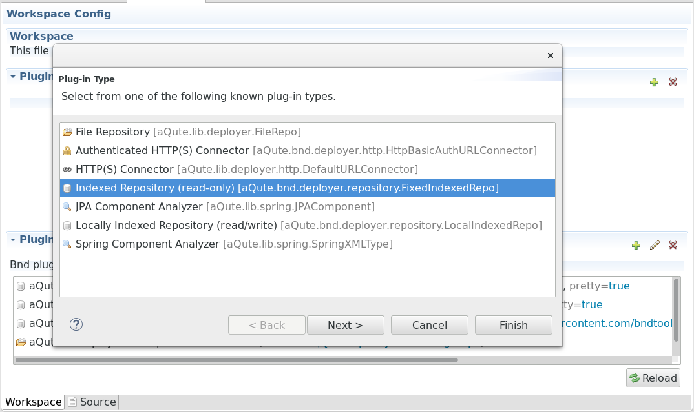

# Using a Service

Now let's really use the log service. Activate the log statement in `HelloWorld` and replace the `System.out.println` statements in `Activator` (comments regarding features explained already have been removed):

```java
public class Activator implements BundleActivator {

    private ServiceTracker<LogService, LogService> logServiceTracker;
    static public LogService logService = null;
    private HelloWorld helloWorld;

    @Override
    public void start(BundleContext context) throws Exception {
        if (logServiceTracker == null) {
            logServiceTracker = new ServiceTracker<LogService, LogService>(
                    context, LogService.class, null) {
                @Override
                public LogService addingService(ServiceReference<LogService> reference) {
                    LogService result = super.addingService(reference);
                    if (isPreferred(reference)) {
                        logService = result;
                    }
                    if (helloWorld == null) {
                        logService.log(LogService.LOG_INFO, "Hello World starting.");
                        helloWorld = new HelloWorld();
                        helloWorld.start();
                        logService.log(LogService.LOG_INFO, "Hello World started.");
                    }
                    return result;
                }

                private boolean isPreferred(ServiceReference<LogService> candidate) {
                    ...
                }
                
                @Override
                public void removedService(ServiceReference<LogService> reference,
                                           LogService service) {
                    super.removedService(reference, service);
                    LogService nowCurrent = getService();
                    if (nowCurrent != null) {
                        logService = nowCurrent;
                        return;
                    }
                    if (helloWorld != null) {
                        logService.log(LogService.LOG_INFO, "Stopping Hello World.");
                        helloWorld.interrupt();
                        try {
                            helloWorld.join();
                        } catch (InterruptedException e) {
                        }
                        helloWorld = null;
                        logService.log(LogService.LOG_INFO, "Hello World stopped.");
                    }
                    logService = null;
                }
            };
        }
        logServiceTracker.open();
    }

    @Override
    public void stop(BundleContext context) throws Exception {
        logServiceTracker.close();
    }
}
```

Running this shows ... nothing. Well, not really nothing, "Hello World" is printed all right. But there are no log messages. Like me, you might be tempted to start searching for a log file. Don't, you won't find anything.

The log service is designed a bit differently from what you expect from a logging *facility*. When `log` is called, the log service creates a `LogEntry`, stores it in an overwriting circular buffer with implementation-specific size and notifies any registered `LogListeners`. In order to see anything, we first have to install and start a bundle that provides and registers a 
[LogListener](https://osgi.org/javadoc/r6/cmpn/index.html?org/osgi/service/log/LogListener.html) with the [log reader service](https://osgi.org/javadoc/r6/cmpn/index.html?org/osgi/service/log/LogListener.html). The log listener forwards the log entries to the console, a file or whatever.

One would assume that it should be easy to find a simple OSGi bundle that implements this functionality. But, I (or the search engine) failed. Instead of spending more time on searching, I decided to provide my own simple [forwarder to standard java.util.logging (JUL)](https://github.com/mnlipp/de.mnl.osgi/raw/master/cnf/releaserepo/de.mnl.osgi.log.fwd2jul/de.mnl.osgi.log.fwd2jul-1.0.0.jar). Which raises the question how you can add an independently provided OSGi bundle to your project.

Focusing on the Eclipse GUI (Bndtools), an easy way is outlined in its [FAQ](http://bndtools.org/faq.html). Looking at things a bit closer, you'll find that the action described there modifies the `cnf` project that had been created when we used Bndtools for the first time. The `cnf` project is needed by the bnd tool that is the basis for Bndtools. The bnd tools refers to the `cnf` directory as its "workspace"[^ws]. Among some other purposes, `cnf` provides a repository for locally imported bundles (subdirectory `localrepo`) and the releases of the bundles under development (subdirectory `releaserepo`). The drag-and-drop approach described in the FAQ adds the bundle to the local repository.

[^ws]: Not to be confused with the Eclipse workspace. The default layout puts `cnf` as a top level project in your Eclipse workspace. However, the only real restriction is that `cnf` must be a sibling of the (bnd) OSGi projects under development. The layout for this introduction uses a [top level](https://github.com/mnlipp/osgi-getting-started) (gradle nature only) project, with `cnf` and the sample bundle projects as children. 

Provided that the bundles that you want to add are maintained in an OSGi repository, a better approach is to add this (remote) repository to the list of repositories that are searched for bundles. This list is initialized from `cnf/ext/repositories.bnd`. The file, however, isn't supposed to be modified. The bnd tool itself supports several ways to add a repository. But the only way compatible with Bndtools is what you get from using the GUI for editing `build.bnd`. 

{: width="700px" }

Click on the plus icon on the right side of the "Plugins" sub-window and a dialog with repository types pops up. Choose "Indexed Repository (read-only)". In the next step of the dialog, enter "`de.mnl.osgi`" as name and "`https://raw.githubusercontent.com/mnlipp/de.mnl.osgi/master/cnf/releaserepo/index.xml`" as location. Bndtools merges the repositories configured in `cnf/ext/repositories.bnd` and the added repositories into a single entry and puts it at the end of `build.bnd`.

```
-plugin: \
	aQute.bnd.deployer.repository.LocalIndexedRepo;name=Release;local=${workspace}/cnf/releaserepo;pretty=true,\
	aQute.bnd.deployer.repository.LocalIndexedRepo;name=Local;local=${workspace}/cnf/localrepo;pretty=true,\
	aQute.bnd.deployer.repository.FixedIndexedRepo;name=Bndtools Hub;locations=https://raw.githubusercontent.com/bndtools/bundle-hub/master/index.xml.gz,\
	aQute.lib.deployer.FileRepo;name=Non OSGi;location=${workspace}/cnf/nonosgi-repo;latest=false,\
	aQute.bnd.deployer.repository.FixedIndexedRepo;readonly=true;name=de.mnl.osgi;locations=https://raw.githubusercontent.com/mnlipp/de.mnl.osgi/master/cnf/releaserepo/index.xml
```


After this change, go back to the "Run" tab of the project's `bnd.bnd` editor. Use the plus icon to add the bundle `de.mnl.osgi.log.fwd2jul` to the "Run bundles".

{: width="500px" }

Run the project again with the augmented set of bundles and see the log messages being printed in the JUL format. List the bundles and stop and start the simple bundle once more and observe the messages.

*To be continued*

---

